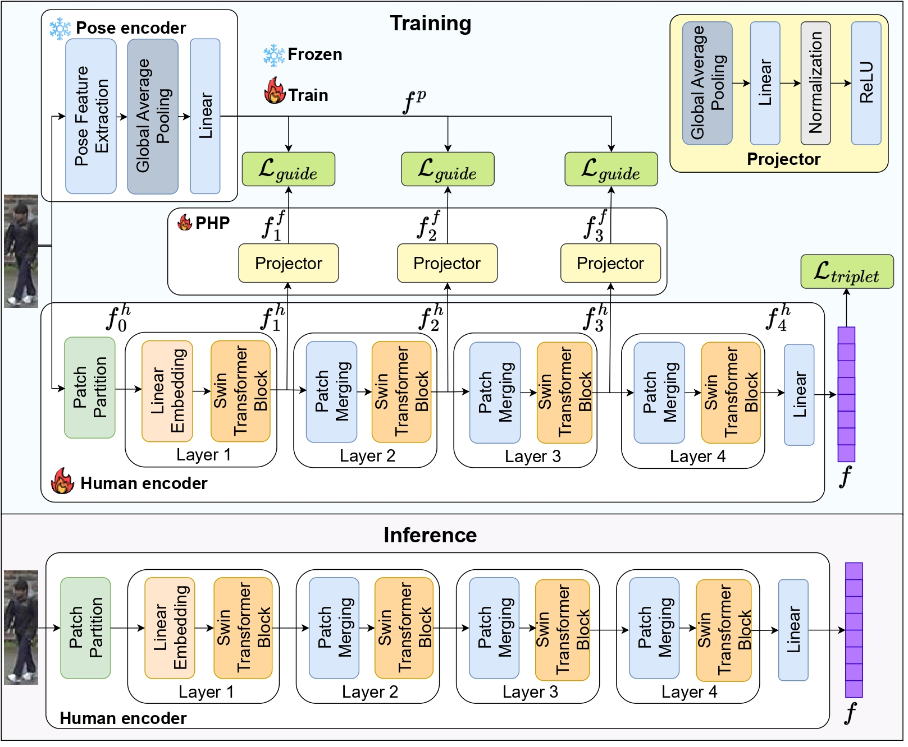

# PGDS: Pose-Guided Deep Supervision for Mitigating Clothes-Changing in Person Re-Identification

This is the official repository of the paper "**PGDS: Pose-Guided Deep Supervision for Mitigating Clothes-Changing in Person Re-Identification**" [](https://ieeexplore.ieee.org/stamp/stamp.jsp?arnumber=10672607) - **AVSS 2024 (Oral Presentation)**

<b>Authors:</b> Quoc-Huy Trinh, Nhat-Tan Bui, Dinh-Hieu Hoang, Phuoc-Thao Vo Thi, Hai-Dang Nguyen, Debesh Jha, Ulas Bagci, Ngan Le, Minh-Triet Tran

## Overview

Person Re-Identification (Re-ID) task seeks to enhance the tracking of multiple individuals by surveillance cameras. It supports multimodal tasks, including text-based person retrieval and human matching. One of the most significant challenges faced in Re-ID is clothes-changing, where the same person may appear in different outfits. While previous methods have made notable progress in maintaining clothing data consistency and handling clothing change data, they still rely excessively on clothing information, which can limit performance due to the dynamic nature of human appearances. To mitigate this challenge, we propose the Pose-Guidance Deep Supervision (PGDS), an effective framework for learning pose guidance within the Re-ID task. It consists of three modules: a human encoder, a pose encoder, and a Pose-to-Human Projection module (PHP). Our framework guides the human encoder, i.e., the main re-identification model, with pose information from the pose encoder through multiple layers via the knowledge transfer mechanism from the PHP module, helping the human encoder learn body parts information without increasing computation resources in the inference stage. Through extensive experiments, our method surpasses the performance of current state-of-the-art methods, demonstrating its robustness and effectiveness for real-world applications.

<div align="center">
    <a href="./">
        
    </a>
</div>

## Installation

This implementation is on the ```python 3.9.0```

To install all necessary packages, install via ```requirements.txt``` file with this command:

```
pip install -r requirements.txt
```

After running this script, all packages will be installed.

## Dataset

All of the dataset will be in the ```./train_data/``` folder. Copy all data to ```./train_data/``` folder. To get access to data, please request [Market-1501](https://academictorrents.com/details/3ea1f8ae1d3155addff586a96006d122587663ee), [Cuhk03](https://www.kaggle.com/datasets/priyanagda/cuhk03), [DukeMTMC](https://academictorrents.com/details/00099d85f6d8e8134b47b301b64349f469303990), [LTCC](https://naiq.github.io/LTCC_Perosn_ReID.html), and [VC-Clothes](https://wanfb.github.io/dataset.html)

After copy full data, change the root data path in the ```./configs/swin_tiny.yaml```

## Base weight

Base weight for the tuning can be download from [SOLIDER](https://github.com/tinyvision/SOLIDER-REID). These weights are carefully tuning in the LU-Person, MSMT17, Market-1501, and LTCC dataset (in case clothes changing needed).

## Training
You can directly run the training script via ```bash run.sh``` or from file ```train.py```

The following command can be used:
```
python train.py --config_file <path to config file>
```

After that, you can view the result of training via ```./logs/<data name>/<project name>/```

## Testing

The testing can be done via ```bash runtest.sh``` or you can run file ```test.py```

You can download our weights or base weight for pose and training from [Google Drive](https://drive.google.com/drive/folders/1Oi3_6bOu8mfZVj_ByeYI788fxqRyHo_J?usp=drive_link)

The following command can be used to test:
```
python test.py --config_file <path to config file>
```
After the testing the test result will be logged in the same folder as the config.

## Result

The result in test dataset can be found in our paper, below is the visualization of attention map from our paper

<div align="center">
    <a href="./">
        
    </a>
</div>

## Citation
```
@inproceedings{trinh2024pgds,
  title={PGDS: Pose-Guidance Deep Supervision for Mitigating Clothes-Changing in Person Re-Identification},
  author={Trinh, Quoc-Huy and Bui, Nhat-Tan and Hoang, Dinh-Hieu and Thi, Phuoc-Thao Vo and Nguyen, Hai-Dang and Jha, Debesh and Bagci, Ulas and Le, Ngan and Tran, Minh-Triet},
  booktitle={2024 IEEE International Conference on Advanced Video and Signal Based Surveillance (AVSS)},
  pages={1--8},
  year={2024},
  organization={IEEE}
}
```
