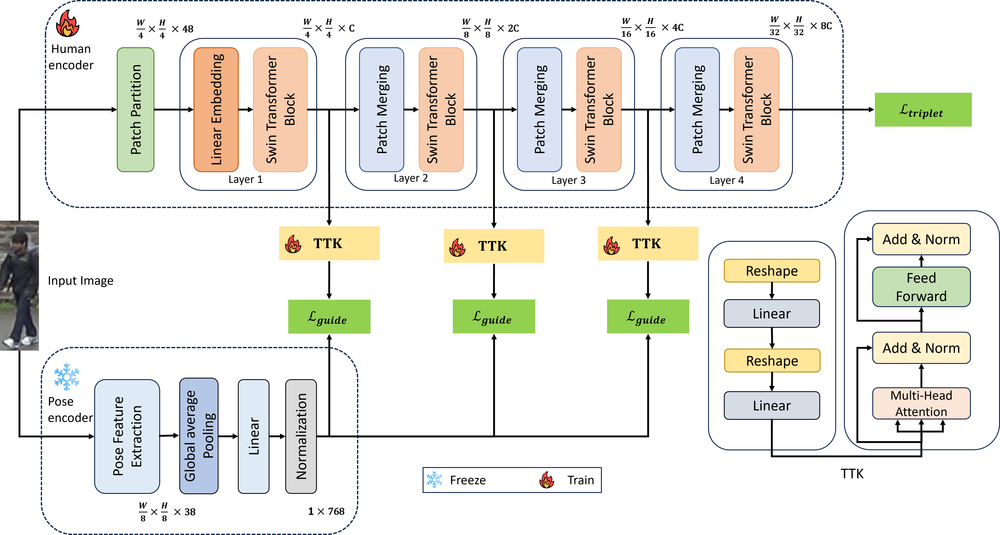

# PGS: Pose-Guided Supervision for Mitigating Clothes-Changing in Person Re-Identification

This is the official repository of the paper "**PGS: Pose-Guided Supervision for Mitigating Clothes-Changing in Person Re-Identification**" [](https://arxiv.org/abs/2312.05634)

<b>Authors:</b> Quoc-Huy Trinh, Nhat-Tan Bui, Dinh-Hieu Hoang, Phuoc-Thao Vo Thi, Hai-Dang Nguyen, Debesh Jha, Ulas Bagci, Ngan Le, Minh-Triet Tran

## Overview

Below is the visualization of our method

<div align="center">
    <a href="./">
        
    </a>
</div>

## Installation

This implementation is on the ```python 3.9.0```

To install all necessary packages, install via ```requirements.txt``` file with this command:

```
pip install -r requirements.txt
```

After running this script, all packages will be installed.

## Dataset

All of the dataset will be in the ```./train_data/``` folder. Copy all data to ```./train_data/``` folder. To get access to data, please request [Market-1501](https://academictorrents.com/details/3ea1f8ae1d3155addff586a96006d122587663ee), [Cuhk03](https://www.kaggle.com/datasets/priyanagda/cuhk03), [DukeMTMC](https://academictorrents.com/details/00099d85f6d8e8134b47b301b64349f469303990), [LTCC](https://naiq.github.io/LTCC_Perosn_ReID.html), and [VC-Clothes](https://wanfb.github.io/dataset.html)

After copy full data, change the root data path in the ```./configs/swin_tiny.yaml```

## Base weight

Base weight for the tuning can be download from [SOLIDER](https://github.com/tinyvision/SOLIDER-REID). These weights are carefully tuning in the LU-Person, MSMT17, Market-1501, and LTCC dataset (in case clothes changing needed).

## Training
You can directly run the training script via ```bash run.sh``` or from file ```train.py```

The following command can be used:
```
python train.py --config_file <path to config file>
```

After that, you can view the result of training via ```./logs/<data name>/<project name>/```

## Testing

The testing can be done via ```bash runtest.sh``` or you can run file ```test.py```

You can download our weights or base weight for pose and training from [Google Drive](https://drive.google.com/drive/folders/1Oi3_6bOu8mfZVj_ByeYI788fxqRyHo_J?usp=drive_link)

The following command can be used to test:
```
python test.py --config_file <path to config file>
```
After the testing the test result will be logged in the same folder as the config.

## Result

The result in test dataset can be found in our paper, below is the visualization of attention map from our paper

<div align="center">
    <a href="./">
        
    </a>
</div>

## Citation
```
@article{pgs,
      title={PGS: Pose-Guided Supervision for Mitigating Clothes-Changing in Person Re-Identification}, 
      author={Quoc-Huy Trinh and Nhat-Tan Bui and Dinh-Hieu Hoang and Phuoc-Thao Vo Thi and Hai-Dang Nguyen and Debesh Jha and Ulas Bagci and Ngan Le and Minh-Triet Tran},
      journal={arXiv:2312.05634},
      year={2023}
}
```
